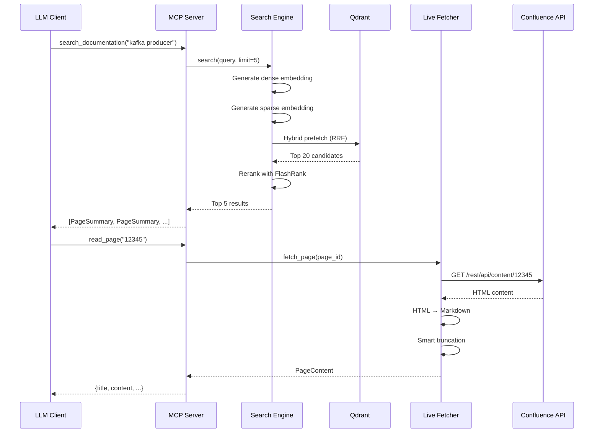

# System Architecture Documentation

## MCP-based Confluence RAG

A production-quality MCP-based Confluence RAG system with live content fetching and hybrid search.

---

## Table of Contents

1. [Executive Summary](#executive-summary)
2. [High-Level Design](#high-level-design)
3. [Low-Level Design](#low-level-design)
4. [Data Pipeline](#data-pipeline)
5. [Component Details](#component-details)
6. [Technology Stack](#technology-stack)

---

## Executive Summary

### Problem Statement

Traditional RAG systems for Confluence documentation face two key challenges:

1. **Stale Data**: Indexed content becomes outdated as documentation evolves
2. **Storage Bloat**: Storing full page content in vector DBs is inefficient

### Solution: Augmented Skeleton Pattern

We solve this with a two-tier approach:

| Tier | Purpose | Storage |
|------|---------|---------|
| **Skeleton Index** | Fast search & navigation | Qdrant vectors |
| **Live Content** | Fresh, accurate content | Confluence API |

**Key insight**: The vector DB acts as a **map** (finding relevant pages), while Confluence acts as a **teleporter** (delivering fresh content).

---

## High-Level Design

### System Architecture

```
┌────────────────────────────────────────────────────────────────────────┐
│                           CLIENT LAYER                                  │
├────────────────────────────────────────────────────────────────────────┤
│                                                                         │
│   ┌─────────────────────┐          ┌─────────────────────┐             │
│   │   Claude Desktop    │          │     LM Studio       │             │
│   │   (STDIO Transport) │          │   (SSE Transport)   │             │
│   └──────────┬──────────┘          └──────────┬──────────┘             │
│              │                                │                         │
└──────────────┼────────────────────────────────┼─────────────────────────┘
               │                                │
               ▼                                ▼
┌────────────────────────────────────────────────────────────────────────┐
│                           MCP SERVER LAYER                              │
├────────────────────────────────────────────────────────────────────────┤
│                                                                         │
│   ┌─────────────────────────────────────────────────────────────────┐  │
│   │                        MCP TOOLS (7)                            │  │
│   ├────────────────────────┬────────────────────────────────────────┤  │
│   │ 🎯 search_and_summarize │ search_documentation │ read_page     │  │
│   │ get_child_pages        │ get_page_metadata    │ summarize_page│  │
│   │ answer_from_page       │                      │               │  │
│   └────────┬───────────────┴────────┬─────────────┴───────┬───────┘  │
│            │                        │                     │          │
└────────────┼─────────────────┼─────────────────┼──────────────┼────────┘
             │                 │                 │              │
             ▼                 ▼                 ▼              ▼
┌─────────────────────────┐   ┌───────────────────────────────────────────┐
│    SEARCH ENGINE        │   │           LIVE FETCHER                    │
├─────────────────────────┤   ├───────────────────────────────────────────┤
│                         │   │                                           │
│  ┌─────────────────┐    │   │  ┌────────────────┐   ┌────────────────┐  │
│  │  Dense Encoder  │    │   │  │ Confluence API │   │ HTML→Markdown  │  │
│  │  (bge-small)    │    │   │  │   (REST)       │   │  Converter     │  │
│  └────────┬────────┘    │   │  └───────┬────────┘   └───────┬────────┘  │
│           │             │   │          │                    │           │
│  ┌────────┴────────┐    │   │          └─────────┬──────────┘           │
│  │  Sparse Encoder │    │   │                    │                      │
│  │  (Splade)       │    │   │          ┌────────┴─────────┐             │
│  └────────┬────────┘    │   │          │ Smart Truncation │             │
│           │             │   │          │   (12k chars)    │             │
│  ┌────────┴────────┐    │   │          └──────────────────┘             │
│  │  RRF Fusion     │    │   │                                           │
│  └────────┬────────┘    │   └───────────────────────────────────────────┘
│           │             │
│  ┌────────┴────────┐    │
│  │  FlashRank      │    │
│  │  Reranker       │    │
│  └────────┬────────┘    │
│           │             │
└───────────┼─────────────┘
            │
            ▼
┌─────────────────────────┐   ┌───────────────────────────────────────────┐
│      QDRANT             │   │           CONFLUENCE                      │
│   (Skeleton Vectors)    │   │        (Live Content)                     │
├─────────────────────────┤   ├───────────────────────────────────────────┤
│ • Page metadata         │   │ • Full page content                       │
│ • Skeleton text         │   │ • Latest version                          │
│ • Dense embeddings      │   │ • Real-time updates                       │
│ • Sparse embeddings     │   │                                           │
└─────────────────────────┘   └───────────────────────────────────────────┘
```

### Request Flow



---

## Low-Level Design

### Module Dependency Graph

```
                    ┌──────────────┐
                    │ config/      │
                    │ settings.py  │
                    └──────┬───────┘
                           │
           ┌───────────────┼───────────────┐
           │               │               │
           ▼               ▼               ▼
    ┌────────────┐  ┌────────────┐  ┌────────────┐
    │ ingestion/ │  │ utils/     │  │ mcp/       │
    └──────┬─────┘  └──────┬─────┘  └──────┬─────┘
           │               │               │
           ▼               ▼               │
┌──────────────────────────────────────────┤
│                                          │
│  ┌────────────────┐  ┌────────────────┐  │
│  │confluence_     │  │ search.py      │◄─┘
│  │client.py       │  └────────────────┘
│  └───────┬────────┘
│          │
│  ┌───────┴────────┐  ┌────────────────┐
│  │skeleton_       │  │html_to_        │
│  │builder.py      │  │markdown.py     │
│  └───────┬────────┘  └────────────────┘
│          │
│  ┌───────┴────────┐
│  │embedder.py     │
│  └───────┬────────┘
│          │
│  ┌───────┴────────┐
│  │live_fetcher.py │
│  └────────────────┘
│
└──────────────────────────────────────────
```

### Class Diagram

```
┌─────────────────────────────────────────────────────────────────────────┐
│                         CONFIGURATION                                    │
├─────────────────────────────────────────────────────────────────────────┤
│                                                                          │
│  ┌─────────────────────────────────────────┐                            │
│  │ Settings (Pydantic)                     │                            │
│  ├─────────────────────────────────────────┤                            │
│  │ + confluence_base_url: str              │                            │
│  │ + confluence_space_key: str             │                            │
│  │ + qdrant_url: str                       │                            │
│  │ + qdrant_collection: str                │                            │
│  │ + mcp_sse_port: int                     │                            │
│  │ + fastembed_cache_path: str             │                            │
│  └─────────────────────────────────────────┘                            │
│                                                                          │
└─────────────────────────────────────────────────────────────────────────┘

┌─────────────────────────────────────────────────────────────────────────┐
│                         INGESTION LAYER                                  │
├─────────────────────────────────────────────────────────────────────────┤
│                                                                          │
│  ┌─────────────────────┐    ┌─────────────────────┐                     │
│  │ ConfluenceClient    │    │ SkeletonBuilder     │                     │
│  ├─────────────────────┤    ├─────────────────────┤                     │
│  │ + base_url          │    │ + base_url          │                     │
│  │ + session           │    │ + excerpt_max_chars │                     │
│  ├─────────────────────┤    ├─────────────────────┤                     │
│  │ + get_all_pages()   │    │ + build_skeleton()  │                     │
│  │ + get_page_content()│    │ + extract_headers() │                     │
│  │ + get_page_metadata │    │ + compute_hash()    │                     │
│  │ + get_child_pages() │    │ + should_update()   │                     │
│  └─────────────────────┘    └─────────────────────┘                     │
│                                                                          │
│  ┌─────────────────────┐    ┌─────────────────────┐                     │
│  │ SkeletonEmbedder    │    │ LiveFetcher         │                     │
│  ├─────────────────────┤    ├─────────────────────┤                     │
│  │ + dense_model       │    │ + client            │                     │
│  │ + sparse_model      │    │ + max_chars         │                     │
│  │ + qdrant            │    ├─────────────────────┤                     │
│  ├─────────────────────┤    │ + fetch_page()      │                     │
│  │ + init_collection() │    │ + get_page_metadata │                     │
│  │ + embed_batch()     │    │ + get_child_pages() │                     │
│  │ + index_pages()     │    └─────────────────────┘                     │
│  └─────────────────────┘                                                │
│                                                                          │
└─────────────────────────────────────────────────────────────────────────┘

┌─────────────────────────────────────────────────────────────────────────┐
│                         SEARCH LAYER                                     │
├─────────────────────────────────────────────────────────────────────────┤
│                                                                          │
│  ┌─────────────────────┐    ┌─────────────────────┐                     │
│  │ HybridSearcher      │    │ SearchResult        │                     │
│  ├─────────────────────┤    ├─────────────────────┤                     │
│  │ + qdrant            │    │ + page_id           │                     │
│  │ + dense_model       │    │ + title             │                     │
│  │ + sparse_model      │    │ + url               │                     │
│  │ + reranker          │    │ + score             │                     │
│  ├─────────────────────┤    │ + excerpt           │                     │
│  │ + search()          │    │ + labels            │                     │
│  │ + _rerank()         │    │ + headers           │                     │
│  │ + get_stats()       │    └─────────────────────┘                     │
│  └─────────────────────┘                                                │
│                                                                          │
└─────────────────────────────────────────────────────────────────────────┘
```

### Data Models

#### PageSkeleton (Qdrant Payload)

```python
{
    "page_id": "12345",                    # Confluence page ID
    "title": "Kafka Producer Guide",       # Page title
    "space_key": "KAFKA",                  # Space key
    "url": "https://...",                  # Full page URL
    "labels": ["producer", "api"],         # Page labels
    "headers": ["Overview", "Config"],     # Extracted headers
    "internal_links": ["23456", "34567"],  # Linked page IDs
    "excerpt": "The Kafka producer...",    # First 500 chars
    "content_hash": "abc123...",           # MD5 for change detection
    "parent_id": "11111",                  # Parent page ID
    "last_updated": "2024-01-05T...",      # ISO timestamp
    "version": 42,                         # Page version
    "skeleton_text": "[TITLE] Kafka..."    # Full skeleton string
}
```

#### Skeleton Text Format

```
[TITLE] Kafka Producer Guide
[SPACE] KAFKA
[LABELS] producer, api, getting-started
[HEADERS] Overview | Configuration | Examples | Troubleshooting
[LINKS] 23456, 34567, 45678
[EXCERPT] The Kafka producer API allows applications to send streams of data...
```

---

## Data Pipeline

### Ingestion Pipeline

```
┌──────────────────────────────────────────────────────────────────────────┐
│                        INGESTION PIPELINE                                 │
└──────────────────────────────────────────────────────────────────────────┘

PHASE 1: FETCH
─────────────────────────────────────────────────────────────────────────────
    ┌───────────────┐       ┌───────────────────────────────────────────┐
    │  Confluence   │──────▶│              Page Iterator                 │
    │     API       │       │  (paginated, max N pages)                 │
    └───────────────┘       └───────────────────┬───────────────────────┘
                                                │
                                                ▼
                            ┌───────────────────────────────────────────┐
                            │  For each page:                           │
                            │  • page_id, title, space_key              │
                            │  • HTML content (body.storage.value)      │
                            │  • version, last_updated                  │
                            │  • labels                                 │
                            └───────────────────┬───────────────────────┘
                                                │
PHASE 2: BUILD SKELETON                         ▼
─────────────────────────────────────────────────────────────────────────────
                            ┌───────────────────────────────────────────┐
                            │           SkeletonBuilder                 │
                            │                                           │
                            │  1. Parse HTML with BeautifulSoup         │
                            │  2. Extract headers (h1-h4)               │
                            │  3. Extract internal links                │
                            │  4. Generate excerpt (first 500 chars)    │
                            │  5. Compute content hash (MD5)            │
                            │  6. Build skeleton_text string            │
                            └───────────────────┬───────────────────────┘
                                                │
PHASE 3: INCREMENTAL CHECK                      ▼
─────────────────────────────────────────────────────────────────────────────
                            ┌───────────────────────────────────────────┐
                            │         Hash Comparison                   │
                            │                                           │
                            │  existing_hash = qdrant[page_id].hash    │
                            │  IF existing_hash == new_hash:           │
                            │      SKIP (page unchanged)                │
                            │  ELSE:                                    │
                            │      CONTINUE to embedding                │
                            └───────────────────┬───────────────────────┘
                                                │
PHASE 4: EMBED                                  ▼
─────────────────────────────────────────────────────────────────────────────
                            ┌───────────────────────────────────────────┐
                            │           Batch Embedding                 │
                            │                                           │
                            │  skeleton_texts = [sk1, sk2, ..., sk64]  │
                            │                                           │
                            │  ┌───────────────┐  ┌───────────────┐    │
                            │  │ Dense Model   │  │ Sparse Model  │    │
                            │  │ bge-small     │  │ Splade        │    │
                            │  │ → [384 dims]  │  │ → {idx: val}  │    │
                            │  └───────────────┘  └───────────────┘    │
                            └───────────────────┬───────────────────────┘
                                                │
PHASE 5: STORE                                  ▼
─────────────────────────────────────────────────────────────────────────────
                            ┌───────────────────────────────────────────┐
                            │           Qdrant Upsert                   │
                            │                                           │
                            │  PointStruct(                             │
                            │      id = uuid5(page_id),                 │
                            │      vector = {                           │
                            │          "dense": [0.1, 0.2, ...],       │
                            │          "sparse": {12: 0.5, 89: 0.3}    │
                            │      },                                   │
                            │      payload = skeleton.to_payload()      │
                            │  )                                        │
                            └───────────────────────────────────────────┘
```

### Search Pipeline

```
┌──────────────────────────────────────────────────────────────────────────┐
│                        SEARCH PIPELINE                                    │
└──────────────────────────────────────────────────────────────────────────┘

INPUT: query = "How to configure Kafka producer acknowledgements?"
─────────────────────────────────────────────────────────────────────────────

STEP 1: QUERY EMBEDDING
─────────────────────────────────────────────────────────────────────────────
    ┌─────────────────────────────────────────────────────────────────────┐
    │                                                                      │
    │   query ──┬──▶ Dense Model ──▶ query_dense = [0.12, -0.05, ...]    │
    │           │                                                          │
    │           └──▶ Sparse Model ──▶ query_sparse = {45: 0.8, 102: 0.4} │
    │                                                                      │
    └─────────────────────────────────────────────────────────────────────┘

STEP 2: HYBRID PREFETCH (Qdrant)
─────────────────────────────────────────────────────────────────────────────
    ┌─────────────────────────────────────────────────────────────────────┐
    │                                                                      │
    │   Prefetch Dense:  Top 20 by cosine similarity                      │
    │   Prefetch Sparse: Top 20 by dot product                            │
    │                                                                      │
    │   ┌───────────────────────┐    ┌───────────────────────┐           │
    │   │ Dense Results         │    │ Sparse Results        │           │
    │   ├───────────────────────┤    ├───────────────────────┤           │
    │   │ 1. Page A (0.89)      │    │ 1. Page C (0.95)      │           │
    │   │ 2. Page B (0.85)      │    │ 2. Page A (0.82)      │           │
    │   │ 3. Page D (0.81)      │    │ 3. Page E (0.78)      │           │
    │   │ ...                   │    │ ...                   │           │
    │   └───────────────────────┘    └───────────────────────┘           │
    │                                                                      │
    └─────────────────────────────────────────────────────────────────────┘

STEP 3: RRF FUSION
─────────────────────────────────────────────────────────────────────────────
    ┌─────────────────────────────────────────────────────────────────────┐
    │                                                                      │
    │   RRF Score = Σ (1 / (k + rank_in_list))  where k = 60 (constant)  │
    │                                                                      │
    │   Page A: 1/(60+1) + 1/(60+2) = 0.0323                              │
    │   Page C: 1/(60+1) = 0.0164                                         │
    │   Page B: 1/(60+2) = 0.0161                                         │
    │   ...                                                                │
    │                                                                      │
    │   Combined Top 20 (sorted by RRF score)                             │
    │                                                                      │
    └─────────────────────────────────────────────────────────────────────┘

STEP 4: RERANKING (FlashRank)
─────────────────────────────────────────────────────────────────────────────
    ┌─────────────────────────────────────────────────────────────────────┐
    │                                                                      │
    │   TinyBERT Cross-Encoder (ms-marco-TinyBERT-L-2-v2)                 │
    │                                                                      │
    │   For each candidate:                                                │
    │       score = CrossEncoder(query, candidate.excerpt)                 │
    │                                                                      │
    │   Reranked Results:                                                  │
    │   1. Page A (0.94) ─▶ Most relevant                                 │
    │   2. Page E (0.87)                                                   │
    │   3. Page C (0.82)                                                   │
    │   4. Page B (0.79)                                                   │
    │   5. Page D (0.71)                                                   │
    │                                                                      │
    └─────────────────────────────────────────────────────────────────────┘

OUTPUT: Top 5 SearchResult objects
─────────────────────────────────────────────────────────────────────────────
```

### Content Fetch Pipeline

```
┌──────────────────────────────────────────────────────────────────────────┐
│                     CONTENT FETCH PIPELINE                                │
└──────────────────────────────────────────────────────────────────────────┘

INPUT: page_id = "12345"
─────────────────────────────────────────────────────────────────────────────

STEP 1: FETCH FROM CONFLUENCE
─────────────────────────────────────────────────────────────────────────────
    ┌─────────────────────────────────────────────────────────────────────┐
    │   GET /rest/api/content/12345?expand=body.storage,version,labels   │
    │                                                                      │
    │   Response: {                                                        │
    │       "id": "12345",                                                 │
    │       "title": "Kafka Producer Config",                              │
    │       "body": {                                                      │
    │           "storage": {                                               │
    │               "value": "<h1>Configuration</h1><p>The acks..."        │
    │           }                                                          │
    │       },                                                             │
    │       "version": {"number": 42, "when": "2024-01-05T..."}           │
    │   }                                                                  │
    └─────────────────────────────────────────────────────────────────────┘

STEP 2: HTML → MARKDOWN
─────────────────────────────────────────────────────────────────────────────
    ┌─────────────────────────────────────────────────────────────────────┐
    │                                                                      │
    │   Input HTML:                                                        │
    │   <h1>Configuration</h1>                                            │
    │   <p>The <strong>acks</strong> setting controls...</p>              │
    │   <table><tr><th>Property</th><th>Default</th></tr>...</table>      │
    │                                                                      │
    │   Output Markdown:                                                   │
    │   # Configuration                                                    │
    │                                                                      │
    │   The **acks** setting controls...                                   │
    │                                                                      │
    │   | Property | Default |                                             │
    │   |----------|---------|                                             │
    │   | acks     | 1       |                                             │
    │                                                                      │
    └─────────────────────────────────────────────────────────────────────┘

STEP 3: SMART TRUNCATION
─────────────────────────────────────────────────────────────────────────────
    ┌─────────────────────────────────────────────────────────────────────┐
    │                                                                      │
    │   IF len(markdown) > 12000:                                         │
    │       1. Find paragraph break near limit                             │
    │       2. Or find sentence end (. ? !)                               │
    │       3. Or find word break (space)                                 │
    │       4. Append: "[Content truncated. View full page at: URL]"      │
    │                                                                      │
    │   is_truncated = True                                                │
    │                                                                      │
    └─────────────────────────────────────────────────────────────────────┘

OUTPUT: PageContent dataclass
─────────────────────────────────────────────────────────────────────────────
    {
        "page_id": "12345",
        "title": "Kafka Producer Config",
        "url": "https://...",
        "content": "# Configuration\n\nThe **acks**...",
        "is_truncated": false,
        "last_updated": "2024-01-05T10:30:00Z",
        "labels": ["producer", "configuration"]
    }
```

### Grounded Synthesis Pipeline

```
┌──────────────────────────────────────────────────────────────────────────┐
│                   GROUNDED SYNTHESIS PIPELINE                             │
│                   (search_and_summarize tool)                             │
└──────────────────────────────────────────────────────────────────────────┘

INPUT: query = "What is a SWIFT message and its formats?"
─────────────────────────────────────────────────────────────────────────────

STEP 1: SEARCH FOR RELEVANT PAGES
─────────────────────────────────────────────────────────────────────────────
    ┌─────────────────────────────────────────────────────────────────────┐
    │   HybridSearcher.search(query, limit=5)                             │
    │                                                                      │
    │   Results:                                                           │
    │   1. "SWIFT Overview" (score: 0.92)                                  │
    │   2. "Message Types" (score: 0.88)                                   │
    │   3. "ISO 20022 Guide" (score: 0.85)                                 │
    │   4. "MT vs MX Comparison" (score: 0.79)                             │
    │   5. "SWIFT Configuration" (score: 0.72)                             │
    └─────────────────────────────────────────────────────────────────────┘

STEP 2: FETCH LIVE CONTENT FROM ALL SOURCES
─────────────────────────────────────────────────────────────────────────────
    ┌─────────────────────────────────────────────────────────────────────┐
    │   For each result:                                                   │
    │       content = LiveFetcher.fetch_page(page_id)                      │
    │       Truncate to 4000 chars per source                              │
    │                                                                      │
    │   sources = [                                                        │
    │       {page: "SWIFT Overview", content: "# SWIFT Overview\n..."},   │
    │       {page: "Message Types", content: "# Message Types\n..."},     │
    │       ...                                                            │
    │   ]                                                                  │
    └─────────────────────────────────────────────────────────────────────┘

STEP 3: COMBINE INTO CONTEXT (LLM SEES ONLY THIS)
─────────────────────────────────────────────────────────────────────────────
    ┌─────────────────────────────────────────────────────────────────────┐
    │                                                                      │
    │   ╔═════════════════════════════════════════════════════════════╗   │
    │   ║  CRITICAL: LLM does NOT see the user's question here!       ║   │
    │   ║  Only the documents. This prevents hallucination.           ║   │
    │   ╚═════════════════════════════════════════════════════════════╝   │
    │                                                                      │
    │   --- Document: SWIFT Overview ---                                   │
    │   # SWIFT Overview                                                   │
    │   SWIFT (Society for Worldwide...)                                   │
    │                                                                      │
    │   --- Document: Message Types ---                                    │
    │   # Message Types                                                    │
    │   MT messages use tag-based format...                                │
    │   ...                                                                │
    │                                                                      │
    └─────────────────────────────────────────────────────────────────────┘

STEP 4: LLM GENERATES GROUNDED SUMMARY
─────────────────────────────────────────────────────────────────────────────
    ┌─────────────────────────────────────────────────────────────────────┐
    │   Prompt:                                                            │
    │   "You are a document synthesis engine.                              │
    │    STRICT RULES:                                                     │
    │    - Use ONLY information from DOCUMENTS below                       │
    │    - Do NOT use external knowledge                                   │
    │    - Cite source for each point [Source: Title]"                     │
    │                                                                      │
    │   LLM Output:                                                        │
    │   • [Source: SWIFT Overview] SWIFT is a network for...               │
    │   • [Source: Message Types] MT messages use tag-based format...      │
    │   • [Source: ISO 20022 Guide] MX messages use XML schema...          │
    │                                                                      │
    └─────────────────────────────────────────────────────────────────────┘

STEP 5: VALIDATE GROUNDING
─────────────────────────────────────────────────────────────────────────────
    ┌─────────────────────────────────────────────────────────────────────┐
    │   Token Overlap Check:                                               │
    │                                                                      │
    │   summary_tokens = tokenize(llm_output)                              │
    │   doc_tokens = tokenize(combined_documents)                          │
    │   overlap = summary_tokens ∩ doc_tokens                              │
    │   grounding_score = len(overlap) / len(summary_tokens)               │
    │                                                                      │
    │   IF grounding_score < 0.5:                                          │
    │       warning = "Low grounding - possible hallucination"             │
    │                                                                      │
    └─────────────────────────────────────────────────────────────────────┘

OUTPUT: SynthesisResult
─────────────────────────────────────────────────────────────────────────────
    {
        "query": "What is a SWIFT message and its formats?",
        "summary": [
            "[Source: SWIFT Overview] SWIFT is a network for...",
            "[Source: Message Types] MT messages use tag-based...",
            "[Source: ISO 20022 Guide] MX messages use XML..."
        ],
        "sources": [
            {"page_id": "123", "title": "SWIFT Overview", "url": "..."},
            {"page_id": "456", "title": "Message Types", "url": "..."},
            {"page_id": "789", "title": "ISO 20022 Guide", "url": "..."}
        ],
        "grounding_score": 0.87,
        "is_grounded": true,
        "total_sources": 3
    }
```

---

## Component Details

### 1. Configuration (`config/settings.py`)

Centralized Pydantic settings with environment variable support:

- **Source of truth** for all configuration
- **Environment files**: `.env`, `.env.local`
- **Type validation** via Pydantic
- **Cached singleton** via `@lru_cache`

### 2. Confluence Client (`ingestion/confluence_client.py`)

REST API wrapper with enterprise-grade resilience:

- **Retry strategy**: Exponential backoff for 429, 500-503
- **Rate limiting**: Respects Retry-After header
- **Pagination**: Automatic handling of multi-page results
- **Auth modes**: PAT or anonymous (public Confluence)

### 3. Skeleton Builder (`ingestion/skeleton_builder.py`)

Generates lightweight page representations:

- **Header extraction**: Parses h1-h4 tags
- **Link extraction**: Finds internal page references
- **Excerpt generation**: First 500 chars, smart truncation
- **Hash computation**: MD5 for change detection

### 4. Embedder (`ingestion/embedder.py`)

Hybrid embedding generation and storage:

- **Dense**: bge-small-en-v1.5 (384 dimensions)
- **Sparse**: Splade_PP_en_v1 (token weights)
- **Batch processing**: 64 items per batch
- **Incremental**: Skips unchanged pages via hash check

### 5. Search Engine (`utils/search.py`)

Hybrid search with reranking:

- **Prefetch**: Dense + Sparse in parallel
- **Fusion**: Reciprocal Rank Fusion (RRF)
- **Rerank**: FlashRank TinyBERT cross-encoder
- **Fallback**: Graceful degradation if reranker unavailable

### 6. Live Fetcher (`ingestion/live_fetcher.py`)

On-demand content retrieval:

- **Fresh content**: Always fetches latest version
- **HTML→Markdown**: Clean conversion with table support
- **Truncation**: Smart 12k char limit
- **Error handling**: Graceful errors for missing pages

### 7. MCP Server (`mcp/`)

Model Context Protocol implementation:

- **SSE transport**: For LM Studio (HTTP streaming)
- **STDIO transport**: For Claude Desktop (stdin/stdout)
- **7 tools**: search_and_summarize (main), search, read, children, metadata, summarize_page, answer_from_page

### 8. Grounded Synthesizer (`utils/synthesizer.py`)

Document-grounded synthesis:

- **Multi-source**: Combines content from multiple pages
- **Strict prompting**: LLM sees ONLY documents, not user query
- **Grounding validation**: Token overlap analysis
- **Citation tracking**: Each point cites its source

---

## Technology Stack

| Layer | Technology | Purpose |
|-------|-----------|---------|
| **Vector DB** | Qdrant | Hybrid vector storage |
| **Dense Embeddings** | FastEmbed (bge-small) | Semantic similarity |
| **Sparse Embeddings** | FastEmbed (Splade) | Keyword matching |
| **Reranking** | FlashRank (TinyBERT) | Cross-encoder scoring |
| **MCP Server** | Python MCP SDK | Protocol implementation |
| **HTTP Server** | Starlette + Uvicorn | SSE transport |
| **HTML Parsing** | BeautifulSoup + lxml | Content extraction |
| **Configuration** | Pydantic Settings | Type-safe config |

---

## Performance Characteristics

| Metric | Target | Typical |
|--------|--------|---------|
| Search latency | < 500ms | ~200-300ms |
| Content fetch | < 2s | ~500ms-1s |
| Ingestion rate | 100+ pages/min | ~150 pages/min |
| Memory footprint | < 2GB | ~1GB |
| Index size (1k pages) | ~50MB | ~30MB |
